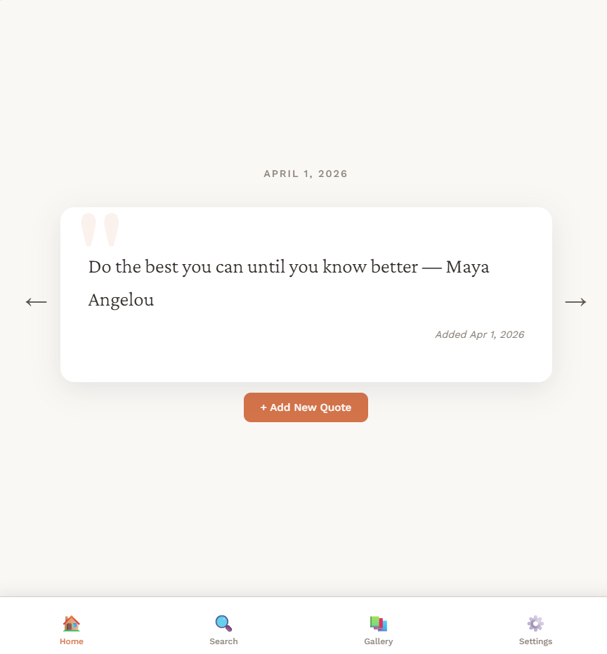

# Daily Wisdom – Full-Stack Quote Platform

A full-stack quote application that allows users to create, store, and manage personal quotes with authentication and cloud synchronization.

## 🚀 Features

* User authentication (Supabase Auth)
* Create, edit, and manage personal quotes
* Cloud storage using Supabase (PostgreSQL)
* Offline-first functionality using IndexedDB
* Automatic sync between local storage and cloud

## 🛠️ Tech Stack

* JavaScript
* Supabase (Auth, Database, Storage)
* PostgreSQL
* IndexedDB
* HTML/CSS

## ⚡ Key Concepts

* Offline-first architecture
* Client-side data persistence
* Sync handling between local and remote databases
* Error handling for failed network requests

## 📈 Status

Currently expanding features and enhancing functionality, reliability, and user experience.