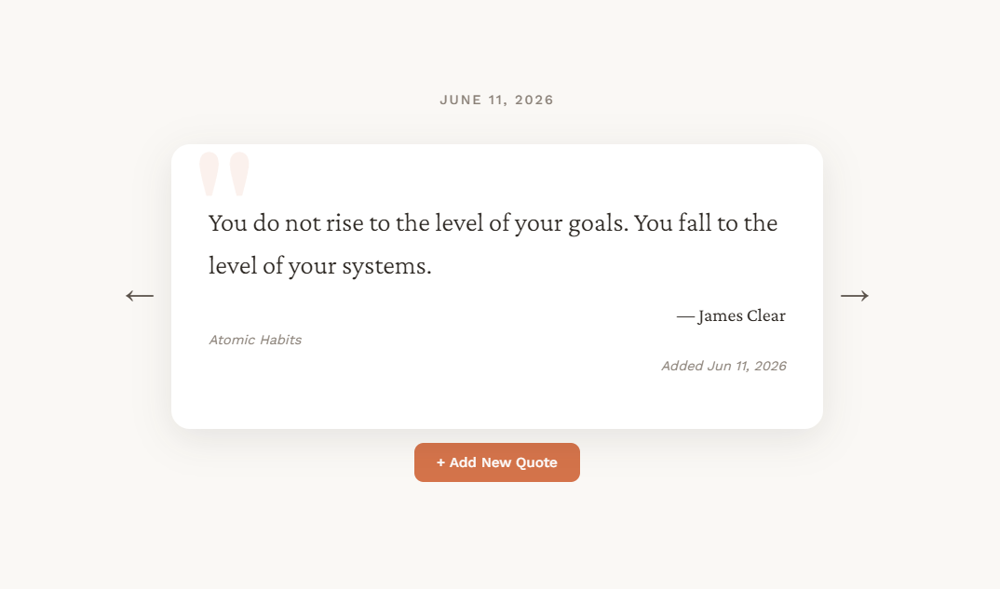

# Daily Wisdom – Full-Stack Quote Platform

The app also bundles a 1,000-entry offline starter library in `src/data/starterQuotes.ts`.
Those records are read-only application data (not IndexedDB or Supabase records), and
are sourced from public-domain editions of La Rochefoucauld's *Reflections*, Chamfort's
*The Cynic's Breviary*, and *The Proverbs* (KJV). Entries with traditional or uncertain
authorship are deliberately credited to `Unknown`.

A full-stack quote application that allows users to create, store, and manage personal quotes with authentication and cloud synchronization.

## 🚀 Features

* User authentication (Supabase Auth)
* Create, edit, and manage personal quotes
* Cloud storage using Supabase (PostgreSQL)
* Offline-first functionality using IndexedDB
* Automatic sync between local storage and cloud

## 🛠️ Tech Stack

* TypeScript
* Supabase (Auth, Database, Storage)
* PostgreSQL
* IndexedDB
* HTML/CSS

## Build

Install dependencies once:

```bash
npm install
```

Compile TypeScript:

```bash
npm run build
```

## ⚡ Key Concepts

* Offline-first architecture
* Client-side data persistence
* Sync handling between local and remote databases
* Error handling for failed network requests

## 📈 Status

Currently expanding features and enhancing functionality, reliability, and user experience.
